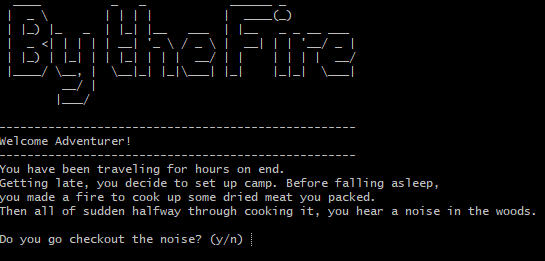

# By the Fire

> Text-Based Adventure as a Wandering Mercenary

## Table of Contents

- [General Info](#general-information)
- [Technologies Used](#technologies-used)
- [Features](#features)
- [Screenshots](#screenshots)
- [Usage](#usage)
- [Project Status](#project-status)
- [Room for Improvement](#room-for-improvement)
- [Acknowledgements](#acknowledgements)
- [Contact](#contact)

## General Information

This project is to make a terminal progam with python will using the input() function. Alongside that to showcase my abilities to use git version control, comand line, and file navigation.

## Technologies Used

- Python - version 3.9.7

## Features

- RNG Choices
- Rich Story
- Quick Playtime

## Screenshots

## Usage

To run the program download the main file.
Then type the following code bellow in the path of that file in your terminal.

`python main.py`

## Project Status

Project is: _in progress_

## Room for Improvement

Room for improvement:

- Refactoring of the code to look prettier
- Logic to showcase RNG attack and fighting

To do:

- Pick a starting weapon or health potion
- A third option story option

## Acknowledgements

- This project was inspired by Codecademy project ideas

## Contact

Created by [@1evi1ong](https://twitter.com/1evi1ong/) - feel free to contact me!
